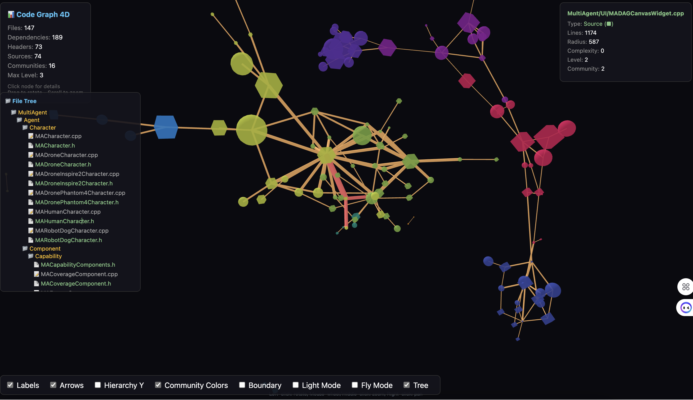
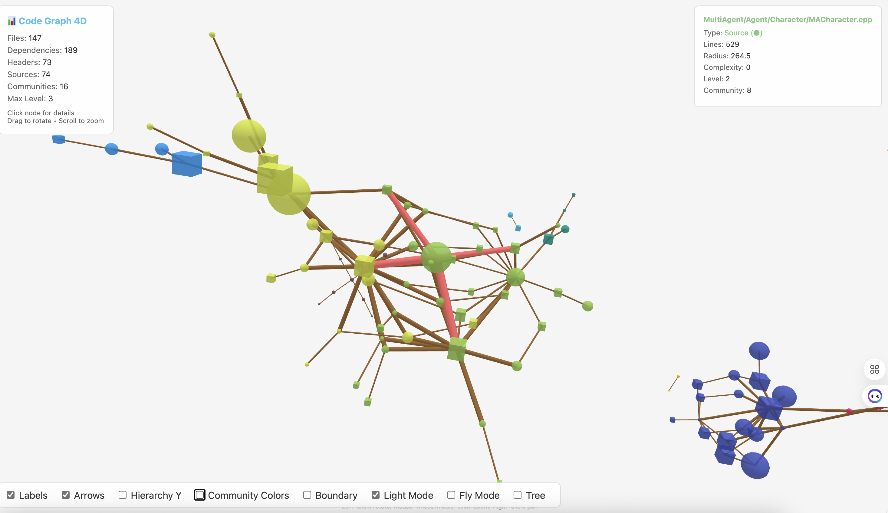

# Code-Graph-4D

[English](README_EN.md) | 中文

C++ 代码库架构的 3D/4D 可视化工具。

## 功能特性

| | |
|:---:|:---:|
|  |  |

- 📁 解析 C++ 源文件（头文件、类、结构体、函数）
- 🔗 通过 `#include` 分析文件依赖关系
- 🌐 浏览器中交互式 3D 力导向图
- 🎨 社区检测（自动发现模块）
- 📊 层级分析
- 🔍 点击高亮依赖链
- 🌳 文件树导航面板
- 🌓 明/暗主题切换
- ✈️ 飞行模式（WASD 导航）

## 快速开始

```bash
./compile_and_start.sh /path/to/cpp/project
```

## 操作说明

| 操作 | 功能 |
|------|------|
| 拖拽 | 旋转视角 |
| 滚轮 | 缩放 |
| 点击节点 | 高亮依赖关系 |
| 点击背景 | 取消高亮 |
| WASD (飞行模式) | 导航 |
| Q/E (飞行模式) | 上升/下降 |

## 可视化说明

- **节点形状**: 头文件 (.h) = 方块 ■, 源文件 (.cpp) = 球体 ●
- **节点大小**: 基于代码行数
- **节点颜色**: 基于社区（自动检测的模块）
- **边的粗细**: 基于引用次数

## 项目结构

```
code-graph-4d/
├── code_graph_4d/
│   ├── main.py              # CLI 入口
│   ├── parser.py            # C++ 解析器
│   ├── graph_builder.py     # NetworkX 图构建
│   ├── visualizer.py        # HTML 生成
│   └── templates/           # 前端模板
├── compile_and_start.sh     # 快速启动脚本
└── README.md
```

## 技术栈

- Python 3.14 + NetworkX
- tree-sitter (C++ 解析)
- 3d-force-graph + Three.js

## 未来计划 (第四维度)

- ⏱️ Git 历史时间线可视化
- 🔥 代码复杂度热力图
- 👥 团队所有权覆盖

## 许可证

MIT
